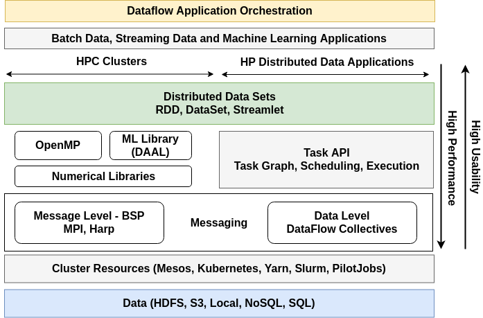
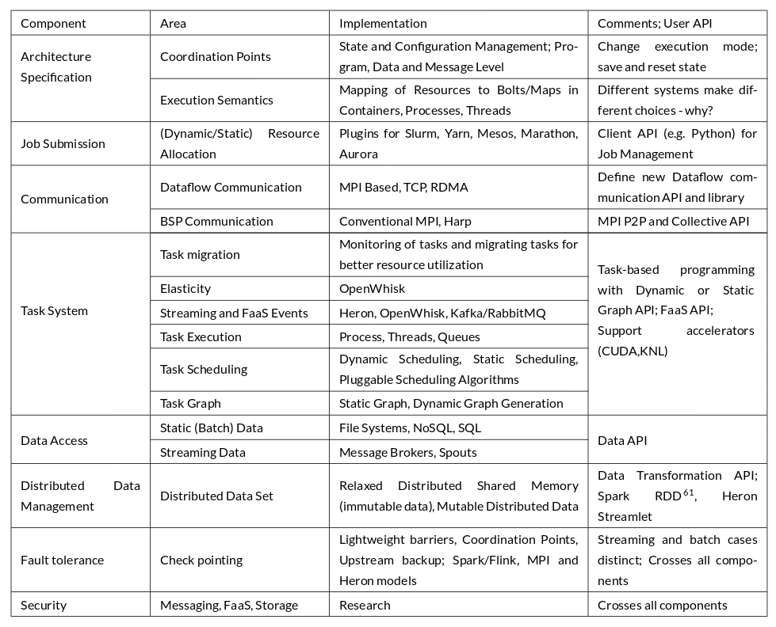

# Architecture

Goal of Twister2 is to provide a layered approach for big data with independent components at each level to compose an application. The layers include: 1. Resource allocations 2. Data Access 3. Communication 4. Task System 5. Distributed Data

Among these communications, task system and data management are the core components of the system with the others providing auxiliary services. On top of these layers, one can develop higher-level APIs such as SQL interfaces. The following figure shows the runtime architecture of Twister2 with various components. Even though shows all the components in a single diagram, one can mix and match various components according to their needs. Fault tolerance and security are two aspects that affect all these components.

The following table gives a summary of various components, APIs, and implementation choices.

## Twister2 Runtime

Twister2 Runtime consists of the following main components.

1. Job Submission Client
2. Job Master
3. Workers

### Job Submission Client

This is the program that the user use to submit/terminate/modify Twister2 jobs. It may run in the cluster or outside of it in the user machine.

### Job Master

Job Master manages the job related activities during job execution such as fault tolerance, life-cycle management, dynamic resource allocation, resource cleanup, etc.

### Workers

The processes that perform the computations in a job.

### Twister2 Web UI \(To Be Added\):

This will present the job related data to users through a web page. Users will be able to monitor their jobs on that web page. Only one instance will run in the cluster and it will provide data for all jobs running in the cluster.

This section describes some of these components in detail.

* [Common](common/logging.md)
* [Discovery](discovery/worker-discovery.md)
* [Discovery](job-master/job-master.md)
