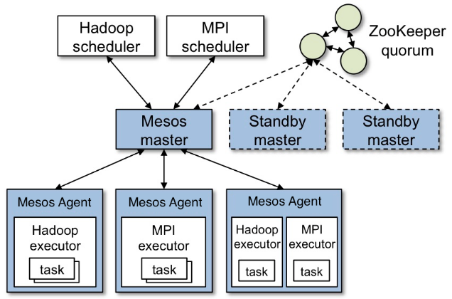
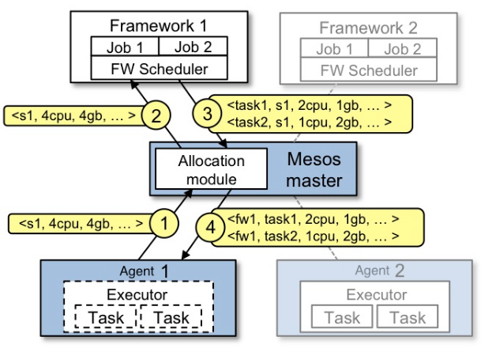

**Twister2 On Mesos**

This document explains the design, features and implementations for
running Twister2 jobs on Mesos clusters. We designed and developed
components to run Twister2 workers and the Job Master in Mesos clusters.

**Mesos Overview**

Mesos is a fault tolerant cluster manager that provides resource
isolation and sharing across distributed applications or frameworks. It
schedules CPU and memory resources across the cluster in much the same
way the Linux Kernel schedules local resources. General Information
provided here about Mesos is taken from Apache Mesos web page.

The Mesos kernel runs on every machine and provides applications with
API's for resource management and scheduling across entire datacenter
and cloud environments. Mesos' two-level architecture allows it to run
existing and new distributed technologies on the same platform.  It can
scale up to 10000 nodes. It uses Zookeeper for fault tolerance.

Figure shows the main components of Mesos. As it can be seen in this
figure, there is a Mesos master and several Mesos agents. The master
enables fine-grained sharing of resources (CPU, RAM, ...) across
frameworks by making them resource offers. Each resource offer contains
a list of &lt;agent ID, resource1: amount1, resource2: amount2, ...&gt;.



      Figure 1:Mesos Architecture\[mesos web page\]

You can find more details on
<http://mesos.apache.org/documentation/latest/>

After installing Mesos master and clients you can use the following
methods to start and test them.

**Starting mesos-master**

```bash
sudo service mesos-master start
```

**Starting mesos slaves**

```bash
sudo service mesos-slave
```

**Checking if the services are running**

```bash
systemctl status <service_name>  -l
```

```text 
example: systemctl status mesos-master -l
```

**Monitoring**
```text 
Mesos Master can be monitored on port 5050 of the machine it is installed.
```
   

**Mesos Framework**

The software that runs on top of a Mesos is called a framework. There
are two components of a framework that run on top of Mesos; a scheduler
and an executor. The scheduler registers with the master to get offer
resources. The executer runs on agent nodes to run framework's task.
 While the master determines how many resources are offered to each
framework, the frameworks\\' schedulers select which of the offered
resources to use. When a framework accepts offered resources, it passes
to Mesos a description of the tasks it wants to run on them. In turn,
Mesos launches the tasks on the corresponding agents.\[ mesos web page\]



     Figure 2: How a framework gets scheduled

This is what happens in figure 2\[Mesos web page\]:

1.  Agent 1 reports to the master that it has 4 CPUs and 4 GB of memory
    free. The master then invokes the allocation policy module, which
    tells it that framework 1 should be offered all available resources.

2.  The master sends a resource offer describing what is available on
    agent 1 to framework 1.

3.  The framework's scheduler replies to the master with information
    about two tasks to run on the agent, using &lt;2 CPUs, 1 GB RAM&gt; for
    the first task, and &lt;1 CPUs, 2 GB RAM&gt; for the second task.

4.  Finally, the master sends the tasks to the agent, which allocates
    appropriate resources to the framework's executor, which in turn
    launches the two tasks (depicted with dotted-line borders in the
    figure). Because 1 CPU and 1 GB of RAM are still unallocated, the
    allocation module may now offer them to framework 2.

**Implementing Twister2 Jobs on Mesos**

Integration of Mesos and Twister2 provided a mechanism that Twister2
jobs can be run on Mesos. Creating a job on Twister2 can be done as
follows;

Necessary values are retrieved from the config file.

```text 
int cpus = MesosContext.cpusPerContainer(config);
int ramMegaBytes = MesosContext.ramPerContainer(config);
int diskMegaBytes = MesosContext.diskPerContainer(config);
int containers = MesosContext.numberOfContainers(config);
``` 

Then we create a ResourceContainer with these resources.

```text
ResourceContainer resourceContainer = new ResourceContainer(cpus, ramMegaBytes, diskMegaBytes);
``` 

The we create the Job as follows;

```text
BasicJob basicJob = BasicJob.newBuilder()
        .setName(jobName)
        .setContainerClass(containerClass)
        .setRequestResource(resourceContainer, containers)
        .setConfig(jobConfig)
        .build();
```

The last thing we do is to submit this job.

```text
Twister2Submitter.submitContainerJob(basicJob, config);
```

Mesos we can run more than one workers(tasks) in Executors. The choice
is left to the user and can be configured through configuration files.
Possible configuration options are;

-   **One Worker per Executor:** One workers will be run each Executor

-   **More Workers per Executor:** Multiple workers can run in a single
    Executor. The number of workers can be set in the configuration
    file.

<!-- -->
```text
# container per mesos executor
twister2.container_per_worker: "1"
```

Initialization of Executors are slower in Mesos. So running more workers
in executors will be a faster solution.

**Job Package**

Twister core package and job package are transferred to the node where
the Mesos master is running. Twister2 core package and the job package
will be transferred to each executors on agents over HTTP protocol.
Therefore, each executor needs the core and job package to be able to
run twiter2 jobs.

When a client submits a job, job and core files uploaded to the machine
which serves as Mesos master. Then Mesos-executors and sandboxes are
created. Mesos has built-in fetcher (See
<http://mesos.apache.org/documentation/latest/fetcher/>) to fetch resource
files to the sandbox. It supports HTTP, HTTPS, FTP and FTPS protocols.
To fetch twister2-core, job file into sandbox directory, upload
directory on the master must be shared via an HTTP server. After
fetching, Mesos unpack these files, read the job file and starts the
job.
