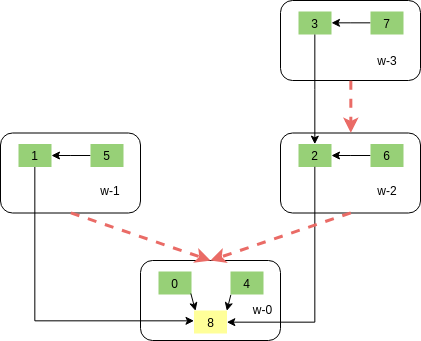

# Communication Model

Twister2 supports a dataflow communication model. A dataflow program models a computation as a graph with nodes of the graph doing user-defined computations and edges representing the communication links between the nodes. The data flowing through this graph is termed as events or messages. It is important to note that even though by definition dataflow programming means data is flowing through a graph, it may not necessarily be the case physically, especially in batch applications. Big data systems employ different APIs for creating the dataflow graph. For example, Flink and Spark provide distributed dataset-based APIs for creating the graph while systems such as Storm and Hadoop provide task-level APIs.

We support the following dataflow operations.

1. Reduce
2. Gather
3. AllReduce
4. AllGather
5. Partition
6. Broadcast
7. Keyed Reduce
8. Keyed Partition
9. Keyed Gather

### Reduce

The reduce operation collects data and performs and reduces them in a manner specified by the reduce
function, which can be specified. To look at an simple example let us assume that we are performing a reduce
operation on the values `{1,2,3,4,5,6,7,8}` if the function specified for the reduce operation was 'Sum'
the result would be `36`, if the function used was 'Multiplication' the result would be `40320`.

Since this reduce is taking place in an distributed environment the same function needs to be applied to data
that is collected from several distributed workers. Which means there is a lot of communications involved in
transferring data between distributed nodes. In order to make the communication as efficient as possible
the reduce operation performs its reduction in a inverted binary tree structure. Lets look at a more 
detailed example to get an better idea about how this operation works. Please note that some details will be left out
to simply the explanation.

Example: 

In this example we have a distributed deployment which has 4 worker nodes named 'w-0' t0 'w-3'. The reduce example
that we are running has 8 source tasks and a single sink task (the task to which the reduction happens). The source
tasks are given logical id from 0 to 7, the sink task is given a logical id of 8.

How each task is assigned to workers will not be explained in this section. We assume that the following task-worker 
assignments are in place. The tree structure that is used by the reduce operation will take into account the task-worker
assignments to optimize the operation. The figure below show the assignments and the paths of communication

Dataflow communications are overlaid on top of worker processes using logical ids.

We support both streaming and batch versions of these operations.

## TaskPlan

Task plan represents how the IDs are overlyed on top of the workers. A worker process will have a unique ID.

## Streaming

Streaming communication is a continuous flow of data.

## Batch

A batch operation works on a finite amount of data. Hence it terminates after the data sending is completed.

## Shuffle Engine

In case of in-sufficient memory, we can persist the data to disk.

## Communication Operation

A communication operation is defined by, set of source IDs, set of target IDs, a message receiver, a partial message receiver and set of edge IDs.

## Detecting termination

Because we are working on a distributed setting with a communication having multiple steps, termination of the operation needs to be detected.

