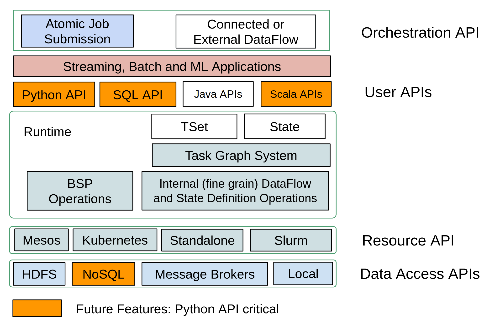
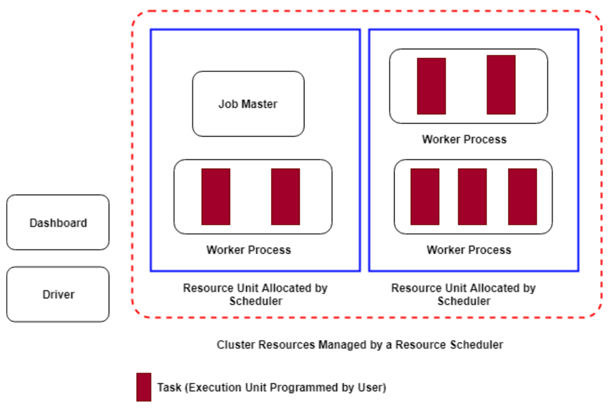

# Distributed Runtime

Each Twister2 job runs in isolation without any interference from other jobs. Because of this 
the distributed runtime of Twister2 is relevant to each job.

At the bottom of the Twister2 is the data access APIs. These APIs provide mechanisms to access data
in file systems, message brokers and databases. Next we have the cluster resource management layer.
Resource API is used for acquiring resources from an underlying resource manager such as Mesos or 
Kubernetes. 

At the bottom of a Twister2 runtime job, there are a set of parallel operators. Twister2 supports both 
BSP style operators as in MPI and DataFlow style operators as in big-data systems. 

The task system is on top of the DataFlow operators. They provide a Task Graph, Task Scheduler and
an Executor. At the runtime, the user graph is converted to an execution graph and scheduled onto
different workers. This graph is then executed by the executor using Threads. 



Twister2 spawns several processes when running a job. 

1. Driver - The program initiating the job
2. Worker Process - A process spawn by resource manager for running the user code. 
3. Task - An execution unit of the program (A thread executes this unit)
4. Job Master - One job master for each job
5. Dashboard - A web service hosting the UI 



## The Job Life-Cycle

There are two modes of job submission for Twister2.

1. Distributed mode
2. Connected DataFlow mode (experimental)

### Distributed mode 

In Distributed mode, a user program is written as an IWorker implementation. The ```twister2 submit```
command initiates the driver program written by the user. 

First the program acquires the resources it needs. Then the user programmed IWorker is instantiated on
the allocated resources. Once the IWorker is executed, it can execute the user program.

Behind the scenes the IWorkers use JobMaster to discover each other and establish network communications 
between them.

Once the Job completes, the workers finish execution and return the resources to the resource allocator.

### Connected DataFlow mode

In Connected DataFlow mode, the program is written inside a Driver interface. This program is serialized 
and sent to the workers to execute. The Driver program written by the user runs in the JobMaster and
controls the job execution.

 


