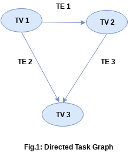
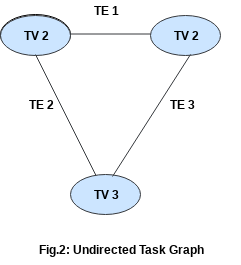

# Task Graph

## Taskgraph in Twister2

Twister2 provides a generic task graph. A task graph 'TG' generally consists of set of Task Vertices'TV' and Task Edges \(TE\) which is mathematically denoted as Task Graph

```text
            (TG) -> (TV, TE)
```

The task graphs can be defined in two ways namely

1. static task graph - the structure of the task graph known at compile time
2. dynamic task graph - the structure of the task graph not known at compile time and the program
 could define the structure of the task graph during runtime.

The following three essential points should be considered while creating and scheduling the task instances of the task graph.

1. Task Decomposition - Identify independent tasks which can execute concurrently
2. Group tasks - Group the tasks based on the dependency of other tasks.
3. Order tasks - Order the tasks which will satisfy the constraints of other tasks.

\(Reference: Patterns for Parallel Programming, Chapter 3 \(2\) & [https://patterns.eecs.berkeley.edu/?page\_id=609](https://patterns.eecs.berkeley.edu/?page_id=609)\)

## Directed Task Graph and Undirected Task Graph

There are two types of task graphs namely directed task graph and undirected task graph. In directed task graph, the edges in the task graph that connects the task vertexes have a direction as shown in Fig.1 whereas in undirected task graph, the edges in the task graph that connects the task vertexes have no direction as shown in Fig 2.

  

The present taskgraph system is capable of generating/considering only directed dataflow task graph which consists of task vertices and task edges. The directed dataflow task graph represents that there is no loops or self-loops. The task vertices represent the source and target task vertex and the task edge represent the edges to connect the task vertices.

## Implementation

### ITaskGraph

ITaskGraph is the main interface consists of multiple methods which is mainly responsible for creating task vertexes \(source and task vertex\) and creating task edges between those vertexes, removing task vertexes \(source and task vertex\) and task edges, and others.

### BaseDataflowTaskGraph

It is the base class for the dataflow task graph which implements the IDataflowTaskGraph interface. This is the main interface for the directed dataflow task graph which consists of methods to find out the inward and outward task edges and incoming and outgoing task edges. It validates the task vertexes and creates the directed dataflow edge between the source and target task vertexes. Also, it performs the validation such as duplicate names for the task, duplicate edges between same two tasks, self-loop in the task graph, and cycles in the task graph.
Some of the main methods available in this class are

```text
            addTaskVertex(TV sourceTaskVertex, TV targetTaskVertex)

            addTaskEge(TV sourceTaskVertex, TV targetTaskVertex, TE taskEges)

            removeTaskVertex(TV taskVertex), removeTaskEdge(TE taskEdge)

            validateTaskVertex(TV source/target vertex)
            
            boolean detectSelfLoop(Set<TV> taskVertex)
            
            detectCycle(TV vertex, Set<TV> taskVertexSet, Set<TV> sourceTaskSet, Set<TV> targetTaskSet)
            
            boolean containsTaskEdge(TE taskEdge)
```

### DataflowTaskGraph

This is the main class which extends the BaseDataflowTaskGraph, it first validate the task graph then store the directed edges into the task map \(which consists of source task vertex and target task vertex\).

### Vertex

Vertex represents the characteristics of a task instance. It consists of task name, cpu, ram, memory, parallelism, and others.

### Edge

Edge represents the communication operation to be performed between two task vertices. It consists of edge name, type of operation, operation name, and others.

### GraphBuilder

The graph builder is the mainly responsible for creating the dataflow task graph which has the methods for connecting the task vertexes, add the configuration values, setting the parallelism, and validate the task graph.

### Operation Mode

The operation mode supports two types of task graphs namely streaming and batch.

