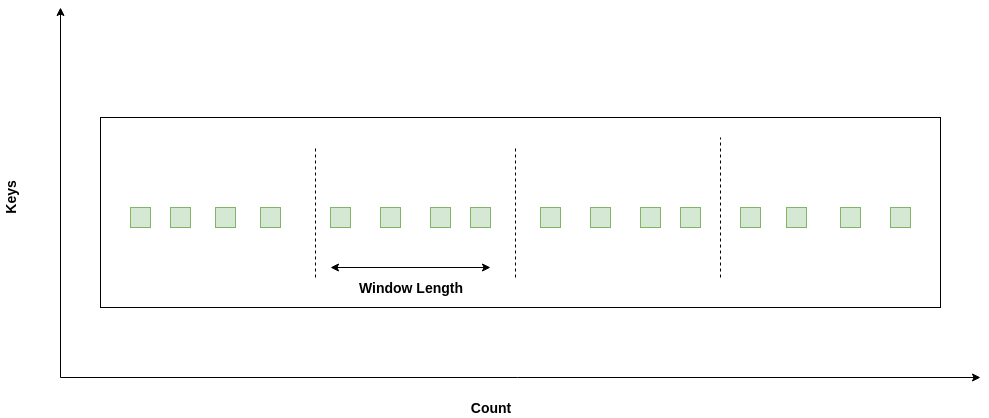
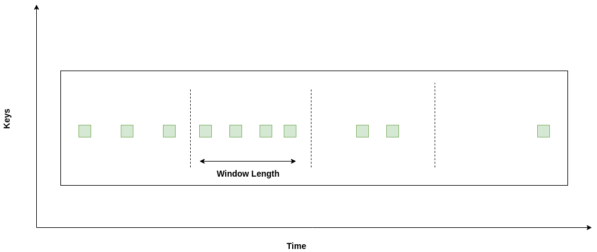
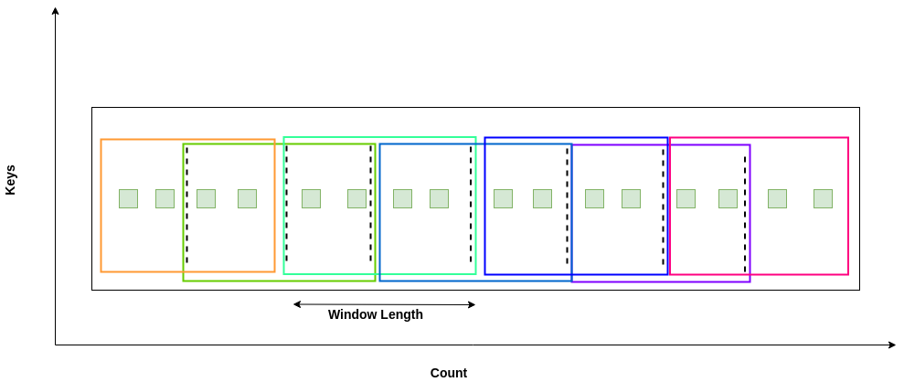
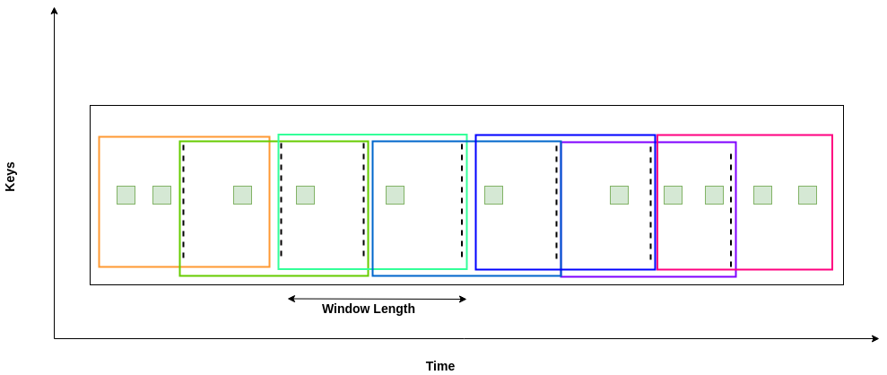

# Windowing

Twister2 Streaming API supports the discretization of a data stream via windowing.
Our Windowing API was developed supporting functionalities in Apache Storm and Apache Flink. 
The core API has inherent features of Apache Storm API. Our windowing API definitions are
derived from the industry standards maintained by Apache Storm and Apache Flink APIs.
The windowing categorization can be found in the following figure. In streaming engines like 
Apache Flink, the key based and non-key based support is discussed for windowing, but in Twister2
we have inbuilt communication functions built for keyed and non-keyed operations. So when user is 
creating a workflow, it can be created using keyed or non-keyed streaming pipelines. 

  

---
**NOTE**

The gray colored boxes with Global and Session Window support is not yet provided in Twister2.

---

## Window Types

### Tumbling 

Tumbling windowing is a fixed size window where the elements belonging to a particular 
window only belong to that window only. There is no repetition of these elements. This is 
also known as fixed windows.  

For example, you can say you need to collect 4 elements per window and this can be a window
based on the number of elements per window.  

   

```java
    BaseWindowedSink dw = new DirectWindowedReceivingTask()
        .withTumblingCountWindow(4);
```

The other way is that you can say, you need to collect some elements per every 2 minutes.



```java
    BaseWindowedSink dwDuration = new DirectWindowedReceivingTask()
        .withTumblingDurationWindow(2, TimeUnit.MINUTES);

```

These are the ways that you can create a tumbling window, based on time and based on the count. 

### Sliding 

Sliding window has two properties, sliding length and window length. Sliding length can be lesser 
than the window length. This can be present in terms of both count and duration. 

For example, you can say you need to collect 4 elements per window and this can be a window
based on the number of elements per window.  

   

```java
BaseWindowedSink sdw = new DirectWindowedReceivingTask()
        .withSlidingCountWindow(4, 2);

```

The other way is that you can say, you need to collect some elements per every 2 minutes.



```java
    BaseWindowedSink sdwDuration = new DirectWindowedReceivingTask()
        .withSlidingDurationWindow(4, TimeUnit.MINUTES,
            2, TimeUnit.MINUTES);
```


### Session

A session window is defined as a window where a presense of an element triggers the window starting, 
but the windowing period terminates after a time out. Currently Twister2 doesn't support this 
function, but it will be added to the next release. 

### Global

Global window is a definition coming in Apache Flink windowing APIs. It provides the ability to 
get same keyed elements to the same window. Twister2 inherent communication APIs can already support
this. You can design your task graph with the specific key selectors to get this done. 
But in an upcoming release, Twister2 will provide a programming abstraction at the windowing level
for users to handle this in another way. 

---
**NOTE**

1. Tumbling window is a special instance of a sliding window where the sliding length equals to window
length. 
2. Duration windowing can have windows with no elements, in processing, the filtering functions can 
be used to avoid issues in calculations or we can design custom policies to manage it. This will be
further discussed in Windowing policies, eviction policies and strategy sections. 

---

## Windowing Policies

Windowing Policies are basically designed to create a dynamic design pattern to provide custom
policy addition capability. For these policy definitions Twister2 uses Apache Storm windowing policy
definitions to support windowing. Windowing policy decides how the boundary of the window is identified
by means of the elements for count based and in terms of watermark or timer for duration based
windows. These are the main types of windowing policies we supports. 

1. Count Windowing Policy
2. Duration Windowing Policy
3. Watermark Count Windowing Policy
4. Watermark Duration Windowing Policy


## Eviction Policies

Eviction policy provides support to the windowing policy to identify the boundary specially for the
duration based and watermark based policies. 

1. Count Eviction Policy
2. Duration Eviction Policy
3. Watermark Count Eviction Policy
4. Watermark Duration Eviction Policy


## Windowing Strategy

1. Tumbling Count Window Strategy
2. Tumbling Duration Window Strategy
3. Sliding Count Window Strategy
4. Sliding Duration Window Strategy


## Window Function

### Reduce Function

### Aggregation Function

### Fold Function

### Window Process Function

## Late Stream Processing

### Function call 

### Late Stream

## Future Implementations

### Session Window

### Global Window


