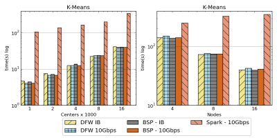

Twister2 provides a data analytics hosting environment where it supports different data analytics 
including streaming, data pipelines and iterative computations. 

Unlike many other big data systems that are designed around user APIs, Twister2 is built from bottom 
up to support different APIs and workloads. Our vision for Twister2 is a complete computing
 environment for data analytics. 
 
One major goal of Twister2 is to provide independent components, that can be used by other 
big data systems and evolve separately. 
 
We support the following components in Twister2

1. Resource provisioning component to bring up and manage parallel workers in cluster environments
    1. Standalone
    2. Kubernetes
    3. Mesos
    4. Slurm 
    5. Nomad
2. Parallel and Distributed Operators in HPC and Cloud Environments
    1. Twister2:Net - a data level dataflow operator library for streaming and large scale batch analysis
    2. Harp - a BSP (Bulk Synchronous Processing) innovative collective framework for parallel applications and machine learning at message level
    3. OpenMPI (HPC Environments only) at message level
3. Task System
    1. Task Graph 
       * Create dataflow graphs for streaming and batch analysis including iterative computations 
    2. Task Scheduler - Schedule the task graph into cluster resources supporting different scheduling algorithms
       * Datalocality Scheduling
       * Roundrobin scheduling
       * First fit scheduling
    3. Executor - Execution of task graph     
       * Batch executor
       * Streaming executor
4. TSet for distributed data representation (Similar to Spark RDD, Flink DataSet and Heron Streamlet)
    1. Iterative computations
    2. Data caching
5. APIs for streaming and batch applications
    1. Operator API
    2. Task Graph based API
    3. TSet API
6. Support for storage systems
    1. HDFS
    2. Local file systems
    3. NFS for persistent storage
7. Web UI for monitoring Twister2 Jobs
8. Apache Storm Compatibility API
9. Connected DataFlow (Experimental)
    1. Supports creation of multiple dataflow graphs executing in a single job

Twister2 can be deployed both in HPC and cloud environments. When deployed in a HPC environment, it 
can use OpenMPI for its communications. It can be programmed at different levels depending on the 
application types giving the user the flexibility to use underlying features.

## High performance communication layer

Because of the bottom up approach taken when designing and implementing Twister2 the communication 
layer performs extremely well. A complete study on the Twister2 communication layer can be found at
[Twister2:Net](https://www.computer.org/csdl/proceedings/cloud/2018/7235/00/723501a383-abs.html). 

The image below which is extracted from [Twister2:Net](https://www.computer.org/csdl/proceedings/cloud/2018/7235/00/723501a383-abs.html) shows how
Twister2 performs against Apache Spark and MPI. Please note that Spark KMeans example is written using the data level API 
while Twister2 and MPI implementations are communication level applications. However it is clear that Twister2 performs on the same
level as OpenMPI which is an highly optimized communication library in the HPC world. And it out performs Spark by roughly a factor of x10.

Notation :   
`DFW` refers to Twister2  
`BSP` refers to MPI (OpenMPI)  

## Road map

We have started working on our next major release that will connect the core components we have developed 
into a full data analytics environment. In particular it will focus on providing APIs around the core
capabilities of Twister2 and integration of applications in a single dataflow. 

### Next release (End of June 2019)

1. Connected DataFlow
2. Fault tolerance
3. Supporting more API's including Beam  
4. Python API
6. More resource managers - Pilot Jobs, Yarn
7. More example applications

### Beyond next release

1. Implementing core parts of Twister2 with C/C++ for high performance 
3. Direct use of RDMA
5. SQL interface 
6. Native MPI support for cloud deployments

## Important Links

Harp is a separate project and its documentation can be found in [website](https://dsc-spidal.github.io/harp/)

We use OpenMPI for HP communications [OpenMPI](https://www.open-mpi.org/)
  
Twister2 started as a research project at Indiana University [Digital Science Center](https://www.dsc.soic.indiana.edu/).

## License

Licensed under the Apache License, Version 2.0: http://www.apache.org/licenses/LICENSE-2.0

## Acknowledgements

This work was partially supported by NSF CIF21 DIBBS 1443054 and the Indiana University Precision Health initiative.
We thank Intel for their support of the Juliet and Victor systems and extend our gratitude to the FutureSystems team for their support with the infrastructure.
